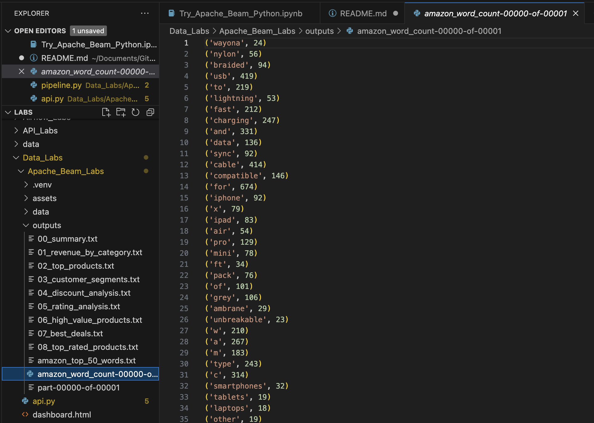

# MLOPS-Lab3-Apache-Beam-Labs

## Amazon E-Commerce Analytics using Apache Beam

A comprehensive data processing pipeline that analyzes Amazon product data using Apache Beam, with a FastAPI backend and interactive web dashboard.

---

## Project Overview

This project demonstrates the transformation of Apache Beam's classic **word count example** into a real-world **e-commerce analytics system**. We process Amazon product data to generate business insights including revenue analysis, customer segmentation, and product recommendations.

---

## What is Built

### **Core Pipeline: Word Count on Amazon Products**
- **Original**: Count word frequencies in Shakespeare's King Lear text file
- **Modified**: Count word frequencies in Amazon product names (CSV data)
- **Advancement**: Added CSV parsing, data validation, and dual output streams

### **Extended Analytics: 8 Business Reports**
1. **Summary Statistics** - Overall sales metrics
2. **Revenue by Category** - Top performing product categories
3. **Top Products** - Best-selling items by revenue
4. **Customer Segmentation** - VIP, Premium, Regular, Casual tiers
5. **Discount Analysis** - Revenue by discount ranges
6. **Rating Analysis** - Product quality distribution
7. **High-Value Products** - Premium items (>₹5,000)
8. **Best Deals** - High discount + high rating combinations

### **Web Dashboard & API**
- **FastAPI Backend**: REST API to trigger pipelines and fetch results
- **Interactive Dashboard**: Real-time analytics visualization with Chart.js
- **Run Pipeline Button**: Execute Apache Beam pipeline from web interface

---

## Key Modifications 

| Component | Original |  Implementation |
|-----------|----------|-------------------|
| **Input** | Text file (`kinglear.txt`) | CSV file (`amazon.csv`) |
| **Data Source** | Plain text lines | Structured e-commerce data |
| **Parsing** | None needed | CSV reader with field extraction |
| **Data Cleaning** | None | Price/rating/percentage cleaning |
| **Validation** | None | Filter null/invalid entries |
| **Outputs** | Single word count | 8 analytics reports + word count |
| **Backend** | None | FastAPI API |
| **Frontend** | None | Interactive HTML dashboard |


## Project Structure

```
Apache_Beam_Amazon_Analytics/
├── data/
│   └── amazon.csv                          # Input dataset (1,351 products)
│
├── outputs/                                # Generated analytics reports
│   ├── 00_summary.txt                      # Overall statistics
│   ├── 01_revenue_by_category.txt          # Category performance
│   ├── 02_top_products.txt                 # Best sellers
│   ├── 03_customer_segments.txt            # Customer tiers
│   ├── 04_discount_analysis.txt            # Discount effectiveness
│   ├── 05_rating_analysis.txt              # Quality metrics
│   ├── 06_high_value_products.txt          # Premium products
│   ├── 07_best_deals.txt                   # Best offers
│   ├── 08_top_rated_products.txt           # Top quality items
│   ├── amazon_word_count-00000-of-00001    # Word frequency (raw)
│   └── amazon_top_50_words.txt             # Top 50 words (formatted)
│
├── pipeline.py                              # Main Apache Beam pipeline
├── api.py                                   # FastAPI backend server
├── dashboard.html                           # Web visualization interface
├── Try_Apache_Beam_Python.ipynb             # Jupyter notebook
└── README.md                                # This file
```

---

## How to Run

### **1. Install Dependencies**
```bash
pip install apache-beam fastapi uvicorn
```

### **2. Run Apache Beam Pipeline**
```bash
python pipeline.py
```

### **3. Start FastAPI Backend**
```bash
python api.py
# API available at: http://localhost:8000
# API Docs: http://localhost:8000/docs
```

### **4. Open Dashboard**
```bash
# Open dashboard.html in your browser
# Or use a local server:
python -m http.server 8080
# Then visit: http://localhost:8080/dashboard.html
```

### **5. Run in Jupyter Notebook**
```python
# Open Try_Apache_Beam_Python.ipynb
# Execute cells to run word count analysis
```

---

## Screenshots

### **1. Word Count Analysis Amazon E-commerce data**


---
### **2. Apache Beam Pipeline Execution**

*Apache Beam pipeline processing Amazon dataset and generating 8 analytics reports*

**Status**: Pipeline execution complete! All output files created successfully.

---

### **2. Analytics Output - Summary Statistics**

*Overall sales analytics: 1,351 products analyzed, ₹6.47M revenue, ₹4.91M customer savings (43.2%)*

---

### **3. Analytics Output - Revenue by Category**

*Category performance - Computers & Electronics leads with ₹4.8M (74% of total revenue)*


---

### **4. Analytics Output - Top Rated Products**

*Top 30 highly-rated products (4.5+ ⭐ with 1000+ reviews)*

**Most Reviewed**: SanDisk Extreme SD Card with 205,052 customer reviews

---


### **5. FastAPI Server Running**

*FastAPI backend started with Uvicorn on http://localhost:8000*

**Features**: Auto-generated API docs, CORS enabled, background task support

---

### **6. FastAPI Interactive Documentation (Swagger UI)**

*Interactive API documentation showing all 9 endpoints with test interface*

**Endpoints**: Health check, analytics summary, categories, products, customers, deals, pipeline trigger

---

### **7. Web Dashboard - Overview with KPIs**

*Interactive dashboard displaying key metrics and visualizations*

**KPIs**: 1,351 products | ₹6.47M revenue | ₹4.91M savings | 4.10⭐ rating

**Charts**: Revenue by Category (bar) and Customer Segments (doughnut)

---

### **8. Web Dashboard - Products & Best Deals**

*Top 10 Products chart and Best Deals table with color-coded savings badges*

**Best Deal**: Fire-Boltt Smart Watch - Save ₹18,200 (91% OFF) | 4.2⭐ | Now ₹1,799


---

## API Endpoints

```
GET  /health                              # System health check
GET  /analytics/summary                   # Overall statistics
GET  /analytics/categories                # Revenue by category
GET  /analytics/products?limit=20         # Top products
GET  /analytics/customers?limit=50        # Customer segments
GET  /analytics/deals?limit=20            # Best deals
GET  /analytics/customer-segments-summary # Segment distribution
POST /run-pipeline                        # Trigger pipeline execution
GET  /download/{report_name}              # Download specific report
```


## Learning Outcomes

Adapted text processing pipeline to structured CSV data  
Implemented robust data parsing and validation  
Created multiple parallel analysis streams  
Built REST API for data access  
Developed interactive visualization dashboard  
Demonstrated Apache Beam's flexibility and scalability  


---
**Novia Dsilva**  
MLOps Lab Assignment - Apache Beam
---
